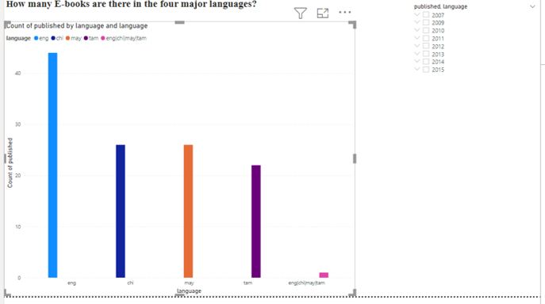
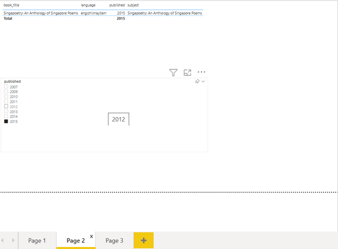

# NLB
This depository aims to understand data analytics and explain what we can do with National Library Board data that can be found in in this site https://data.gov.sg/dataset?q=NLB
National Library Board READ! Singapore Short Stories 
The questions we would like to ask is:
- What are the languages of books in this ebook database?
- Are there any unusual book in multiple languages?
- Which book is this?
- How many books are added to the ebook database in each year?

Business Intelligence and Analytic companies like PowerBI shown below helps us to visualize the data. 
Descriptive Analytics

From the year 2007 to 2015, there are books in four major languages, English, Chinese, Tamil and Malay.

- Why is there a book in all four languages? 
- This is Diagnostic Analytics. We find out the year this book is printed look it up via another visualisation that filters the year the books were published.

- We discovered that this book is a collection of Poems in Singapore, which is probably why it is in four major languages.
